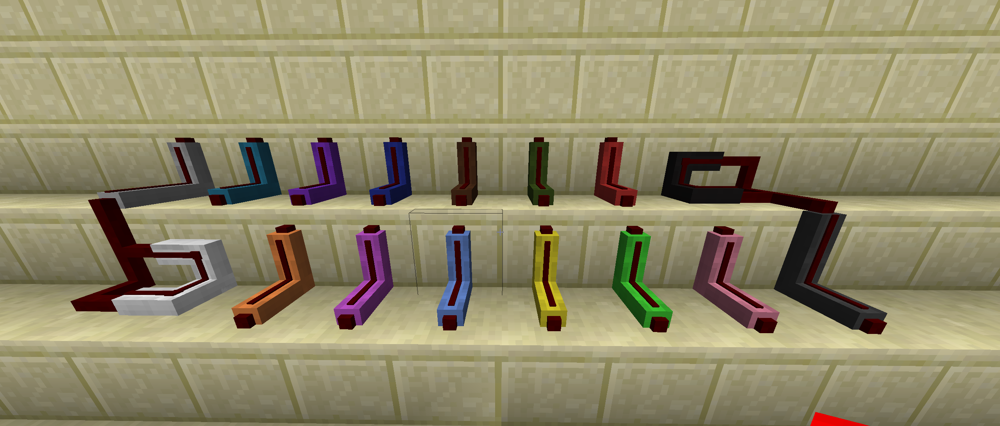

# BluePower Red Alloy Wire

### Colours:
Red alloy wire comes in all 16 different colours and with an unshielded version.
The principle behind the colours is to make compact wiring possible without interconnections between differently coloured wires.

