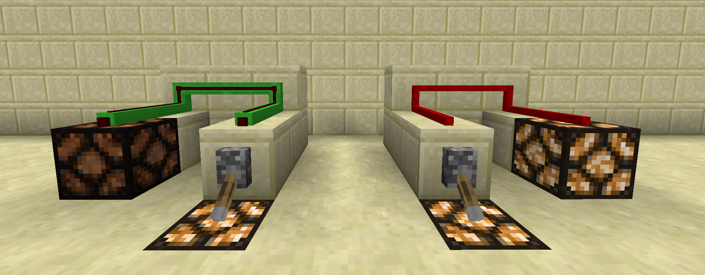

# Red Alloy Wire
---
#### Colours

Red alloy wire comes in all 16 different colours and with an unshielded version.

The principle behind the colours is to make compact wiring possible without interconnections between differently coloured wires.
An unshielded piece of Red Alloy Wire can connect to any coloured/shielded piece of Red Alloy Wire. Yet a coloured wire will only connect to similarly coloured wires 

Red Alloy Wire can be placed on any face of a full block or the outside of a MicroPart.
It is not possible to place Red Alloy Wire on the inside of a MicroPart.

---
#### Redstone

The signal within a Red Alloy Wire can have any value from 0 to 255, while normal Redstone Dust can only handle 0-15.
Similar as Redstone Dust, the Red Alloy Wire will lose 1 strength for every block it travels.

Shielded Red Alloy Wire can not transmit a redstone signal trough a block. Unshielded Red Alloy Wire can however.

